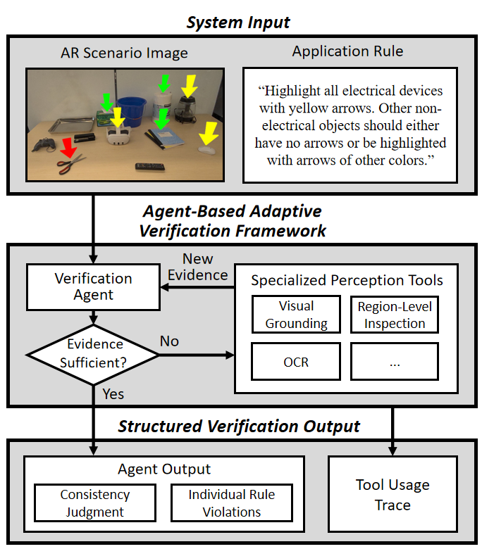
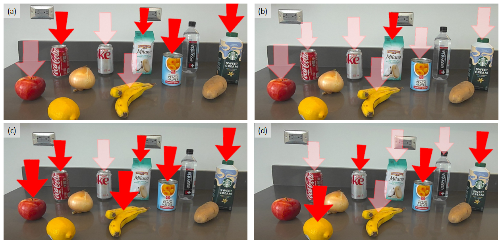
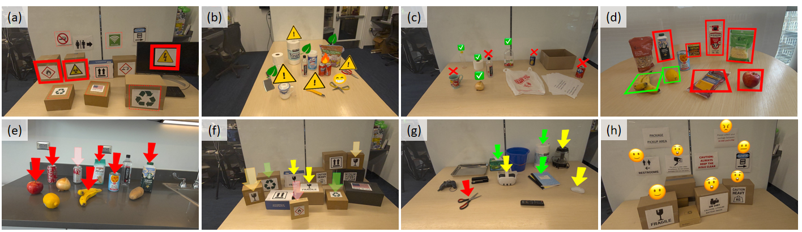
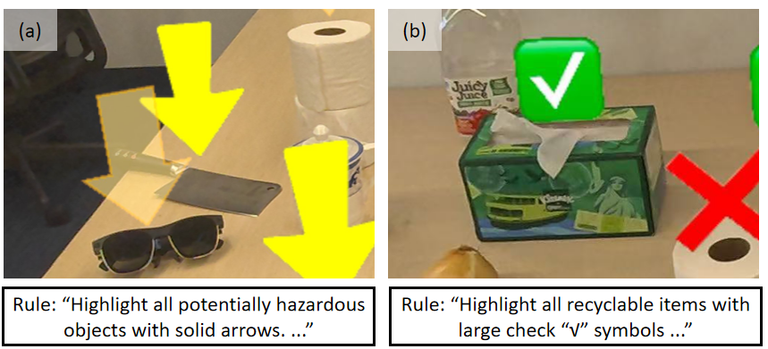

# AI Agent-Based Verification of Rule-Content Consistency in Augmented Reality

This is the official repository of the paper **"AI Agent-Based Verification of Rule-Content Consistency in Augmented Reality"**, submitted to **IEEE VR 2027**. The repository contains the implementation of our agent-based adaptive verification framework, the evaluation scenarios, and the associated annotations.

The evaluation dataset is included directly in this repository under [`/dataset`](./dataset).

Augmented reality (AR) applications increasingly use virtual content to communicate application-specific rules, such as highlighting hazardous objects, indicating recyclable items, or providing safety-related guidance. When virtual content is incorrectly generated or applied, the displayed augmentation may become inconsistent with the intended application rule and potentially mislead users.

This project studies **rule-content consistency verification in AR** and introduces an **agent-based adaptive verification framework** that dynamically gathers visual evidence through specialized perception tools before producing a consistency judgment.

---

## Overview

<p align="center">
  
</p>

Given an **AR scenario image** and a natural-language **application rule**, the verification agent determines what visual evidence is needed and selectively invokes perception tools during reasoning. The current framework includes:

- **Visual grounding** using SAM 3
- **Region-level inspection** using a vision-language model
- **Optical character recognition (OCR)** using EasyOCR

Rather than following a fixed perception pipeline, the agent adaptively decides which entities and regions require inspection, which tool to invoke, and what evidence is needed before reaching a final decision.

The framework returns:

1. an overall **consistency judgment**,
2. the detected **individual rule violations**, and
3. a **tool-use trace** describing the evidence-gathering process.

---

## Dependencies and Environment

The experiments were conducted with **Python 3.12.13**. The core software dependencies are:

| Package | Version |
|---|---:|
| PyTorch | 2.13.0 |
| Torchvision | 0.28.0 |
| OpenAI Python SDK | 2.54.0 |
| OpenAI Agents SDK | 0.20.0 |
| EasyOCR | 1.7.2 |
| OpenCV (headless) | 5.0.0.93 |
| NumPy | 2.5.2 |
| Pillow | 12.3.0 |
| SAM 3 | 0.1.0 |

The agent framework uses the **OpenAI Agents SDK** for adaptive tool invocation and the **OpenAI Python SDK** for model access. **SAM 3** provides text-prompted visual grounding, while **EasyOCR** is used for text recognition.

SAM 3 was installed separately from its source repository as a local editable package. Because SAM 3 installation depends on the local PyTorch/CUDA configuration, we recommend following the official SAM 3 installation instructions rather than installing it as a generic PyPI dependency.

A minimal set of Python dependencies for the remaining components is:

```bash
pip install \
    openai==2.54.0 \
    openai-agents==0.20.0 \
    easyocr==1.7.2 \
    torch==2.13.0 \
    torchvision==0.28.0 \
    opencv-python-headless==5.0.0.93 \
    numpy==2.5.2 \
    pillow==12.3.0
```

---


## How to Use

Before running the experiments, create a `.env` file in the project root and add your OpenAI API key:

```bash
OPENAI_API_KEY=your_openai_api_key_here
```

### Agent-Based Verification

Open and run `experiment_agent.ipynb`.

In the first cell, modify `MODEL` and `THINKING` to select the verification backbone and reasoning effort.

Supported model options:

```text
gpt-5.6-sol
gpt-5.6-terra
gpt-5.6-luna
```

Supported reasoning-effort options:

```text
low
medium
high
xhigh
max
```

### Baseline Verification

Open and run `experiment_baseline.ipynb`.

As in the agent notebook, modify `MODEL` and `THINKING` in the first cell to select the model and reasoning effort from the options listed above.

### Outputs

Experiment outputs are saved as:

- `raw_results.json` — the original model outputs generated during evaluation.
- `core_results.json` — a structured summary extracted from the raw outputs for easier evaluation and analysis.

For the results reported in the paper, the generated outputs (raw results) were manually inspected against the validated ground-truth annotations to ensure consistent and accurate evaluation. For the GitHub release, we additionally provide an automated post-processing pipeline to enable faster feedback and easier experimentation. Specifically, **GPT-5.6 Luna** is used to analyze `raw_results.json` and generate the structured `core_results.json`.

---

## Rule-Content Consistency

An application rule specifies two conceptually distinct aspects of intended AR behavior:

1. **Target selection** — which physical and virtual elements are relevant to the rule.
2. **Relationship specification** — how those physical and virtual elements should relate.

For example, a rule may require all food items containing added sugar to be highlighted with **solid arrows pointing toward them**, while other food items should either have no arrows or use transparent arrows.

We define four mutually exclusive rule-content outcomes:

<p align="center">
  
</p>

- **Consistent** — all required relationships are present and no unintended relationship occurs.
- **Omission** — at least one target physical entity is missing a required rule-conforming relationship.
- **Commission** — a non-target physical entity participates in a relationship that otherwise conforms to the rule.
- **Mixed** — omission and commission occur simultaneously.

To instantiate these rules in controlled AR scenarios, we primarily use virtual highlighting of physical entities through arrows, bounding boxes, and icons. This provides explicit physical-virtual relationships while allowing the semantic criteria that determine which objects should be highlighted to vary across applications.

The dataset covers **8 AR applications** and **27 application-rule combinations**. For each rule, we construct one scenario for each of the four outcomes above, resulting in **108 AR scenarios**. Omission and commission scenarios contain one to three individual inconsistencies, while mixed scenarios contain three to six. Across the complete dataset, this results in **224 individual rule-content inconsistencies**.

All AR images were captured from constructed scenarios using a **Meta Quest 3**. Virtual content was instantiated in **Unity** and manually positioned to create the intended physical-virtual relationships. The resulting annotations were subsequently reviewed by **five independent annotators**. All scenario annotations and associated metadata are provided in [`/dataset/all_metadata.json`](./dataset/all_metadata.json).

---

## Evaluation Scenarios

We construct a controlled evaluation set spanning **8 AR applications**, **27 application rules**, and **108 AR scenarios**.

<p align="center">
  
</p>

The eight application categories are:

- Safety inspection
- Workplace hazard inspection
- Waste sorting assistance
- Food allergen indication
- AR-assisted diet food examination
- Warehouse / package-handling assistance
- Electrical device identification
- Warning text identification

For each application, we design three or four application-specific rules. For every application-rule combination, we create four scenarios corresponding to the four rule-content outcomes above.

| Item | Count |
|---|---:|
| AR applications | 8 |
| Application rules | 27 |
| AR scenarios | 108 |
| Individual inconsistencies | 224 |
| Independent annotation validators | 5 |

All AR images were captured from constructed scenarios using a Meta Quest 3. Virtual content was instantiated in Unity and manually positioned to create controlled physical-virtual relationships while preserving the appearance of an actual AR view.

---

## Agent-Based Verification Framework

### Visual Grounding

The agent can invoke **SAM 3** with a text query to localize physical objects or virtual elements. Grounded detections are grouped when they overlap or are spatially close.

For each grounded region, the system generates two local views:

- a **tight crop** that emphasizes the localized entity for fine-grained appearance and identity inspection, and
- a **contextual crop** that preserves broader scene context for analyzing physical-virtual spatial relationships.

### Region-Level Inspection

The agent can submit a selected local crop together with a dynamically generated question to a vision-language model. This enables targeted inspection of object identity, visual attributes, virtual-content appearance, placement, and directional or spatial relationships.

### OCR

The agent can invoke **EasyOCR** on either the full AR image or a localized region when textual evidence is relevant to the current rule.

### Adaptive Evidence Gathering

Tool use is controlled by the verification agent. At each reasoning step, the agent determines whether additional evidence is needed. If so, it selects a perception tool, generates the corresponding query or arguments, incorporates the returned observation into its context, and continues reasoning.

Tool calls are executed sequentially so that each observation can inform the next decision. The process terminates once the agent determines that sufficient evidence has been gathered to assess the rule.

---

## Evaluation

We compare the agent-based framework against two whole-scene reasoning baselines:

- **Direct** — direct whole-scene reasoning using medium reasoning effort
- **Max** — direct whole-scene reasoning using maximum reasoning effort
- **Agent** — adaptive verification with external perception tools

We evaluate performance at both the scenario level and the individual-violation level using:

- Binary Accuracy
- Exact Match Accuracy
- Precision
- Recall
- F1
- End-to-end latency

### Main Results

Our best configuration achieves:

| Metric | Result |
|---|---:|
| Binary inconsistency detection accuracy | **98.15%** |
| Exact Match accuracy | **84.26%** |
| Individual inconsistency precision | **91.32%** |
| Individual inconsistency recall | **98.66%** |
| Individual inconsistency F1 | **94.85%** |

The agent-based framework provides its clearest gains for **fine-grained verification**, where the system must identify the complete set of individual rule violations rather than merely determine whether any inconsistency exists.

With the strongest backbone, Agent improves Exact Match accuracy from **70.37%** under Direct reasoning to **84.26%**, while F1 increases from **87.66%** to **94.85%**.

These gains come with additional processing latency because the agent may perform multiple rounds of grounding and region-level inspection before reaching a final decision.

---

## Tool-Use Behavior

The agent actively uses the perception toolbox rather than defaulting to whole-scene reasoning alone.

Across the evaluated backbones, visual grounding and region-level inspection are used frequently, while OCR is invoked less often because textual evidence is only relevant to a subset of scenarios.

The number and type of tool calls vary across model backbones, showing that the evidence-gathering process adapts to the behavior of the underlying verification model.

---

## Failure Cases

<p align="center">
  
</p>

The remaining errors mainly arise from two sources:

- **Physical-entity recognition errors**, where the agent grounds the correct physical-virtual relationship but misidentifies the underlying object.
- **Application-specific semantic reasoning errors**, where the physical entity is recognized correctly but the agent applies an inappropriate interpretation of the rule.

In the evaluated scenarios, we did not observe a final verification error primarily caused by an incorrect association between virtual content and its physical referent. This suggests that adaptive grounding and region-level inspection effectively support physical-virtual association, while entity recognition and application-specific semantic reasoning remain important sources of residual error.

---

## Key Findings

- Application-specific AR rules can be represented through **target selection** and **relationship specification**.
- Rule-content errors can be systematically characterized as **omission**, **commission**, or **mixed** inconsistencies.
- Adaptive perception improves fine-grained verification compared with direct whole-scene reasoning.
- Simply increasing internal reasoning effort does not consistently substitute for gathering task-relevant visual evidence.
- Remaining errors are driven more by object recognition and semantic interpretation than by physical-virtual association.
